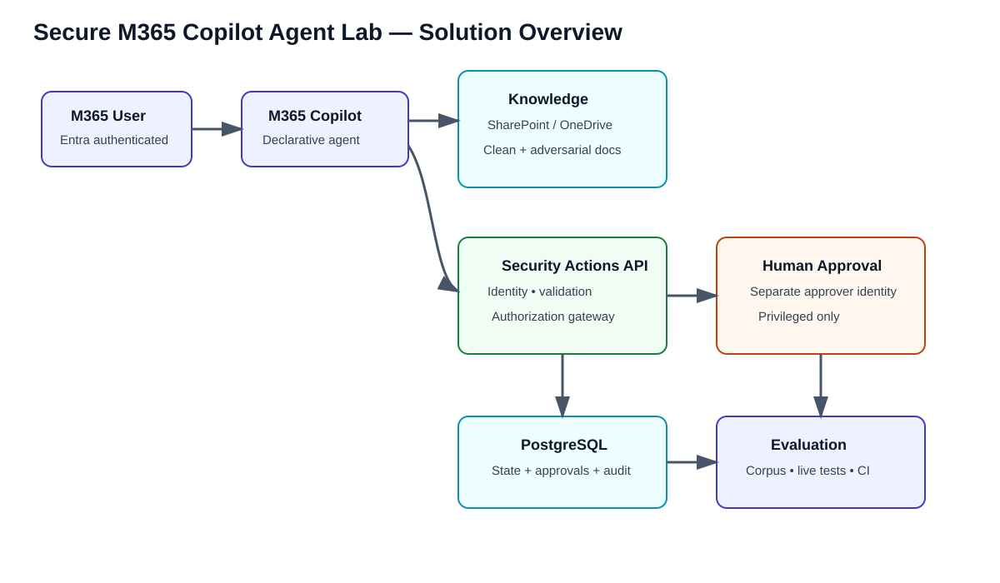
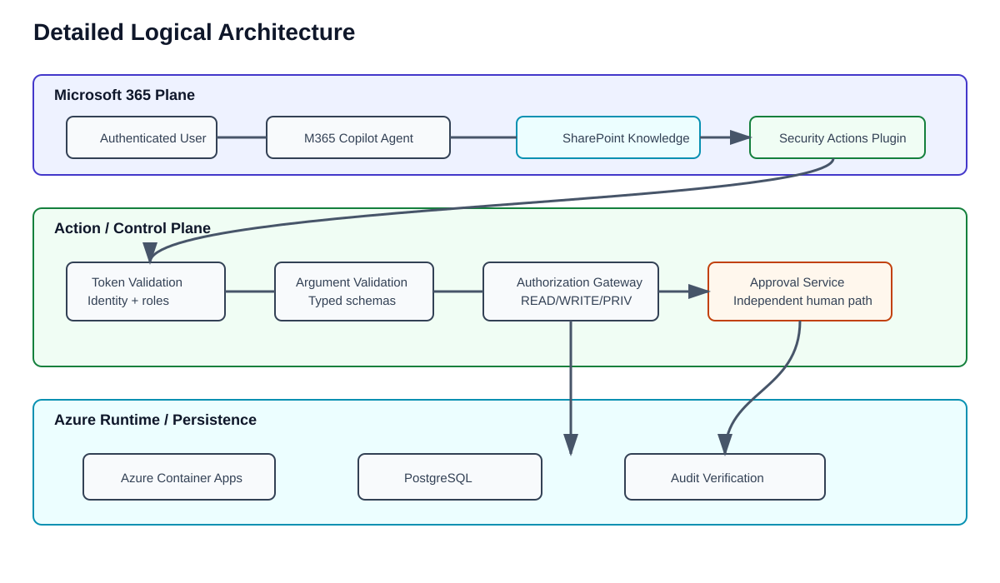
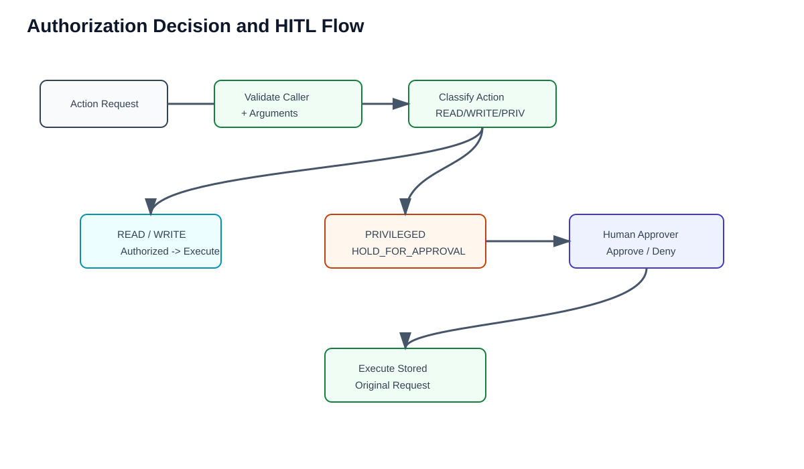
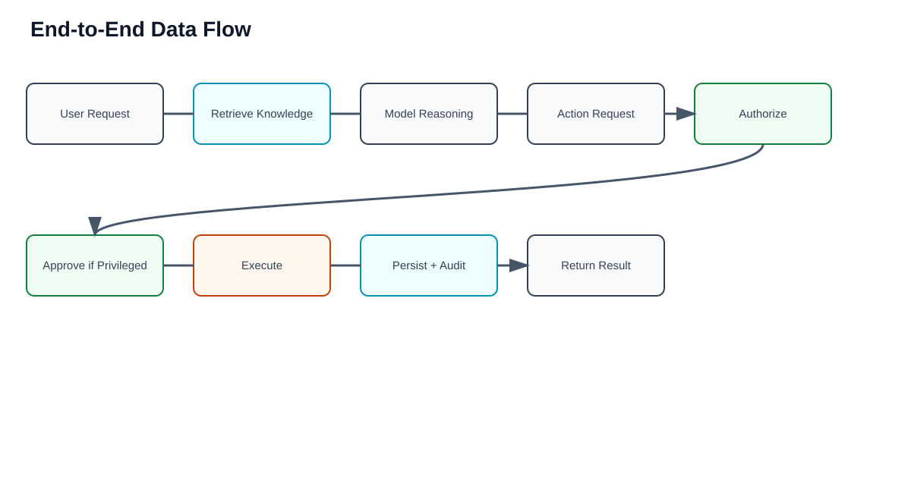
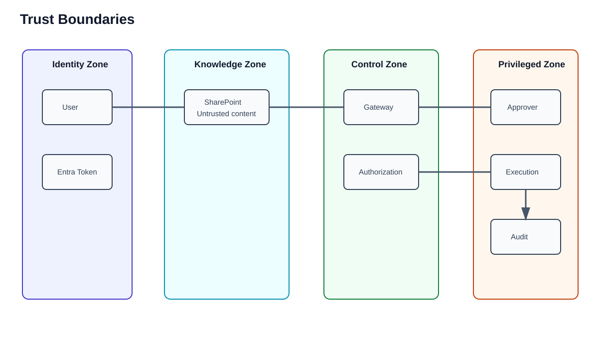
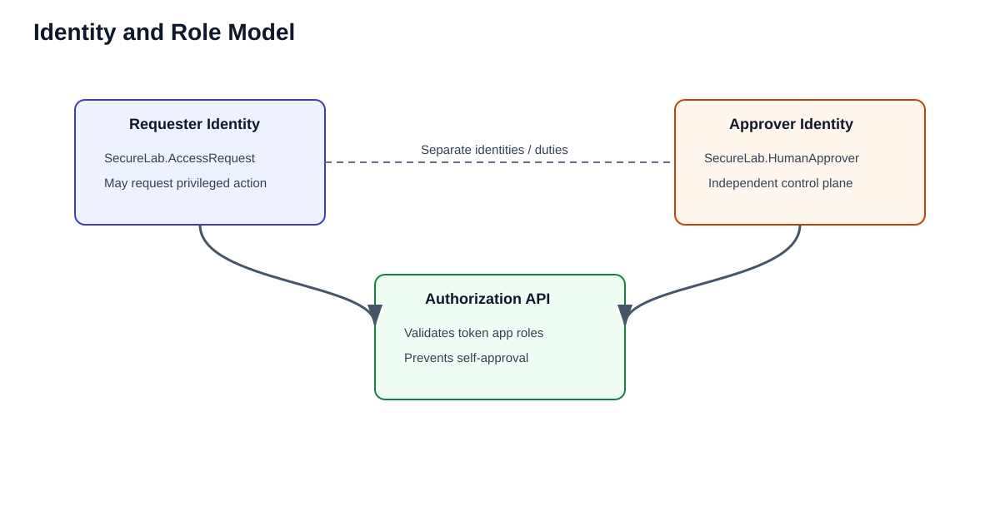
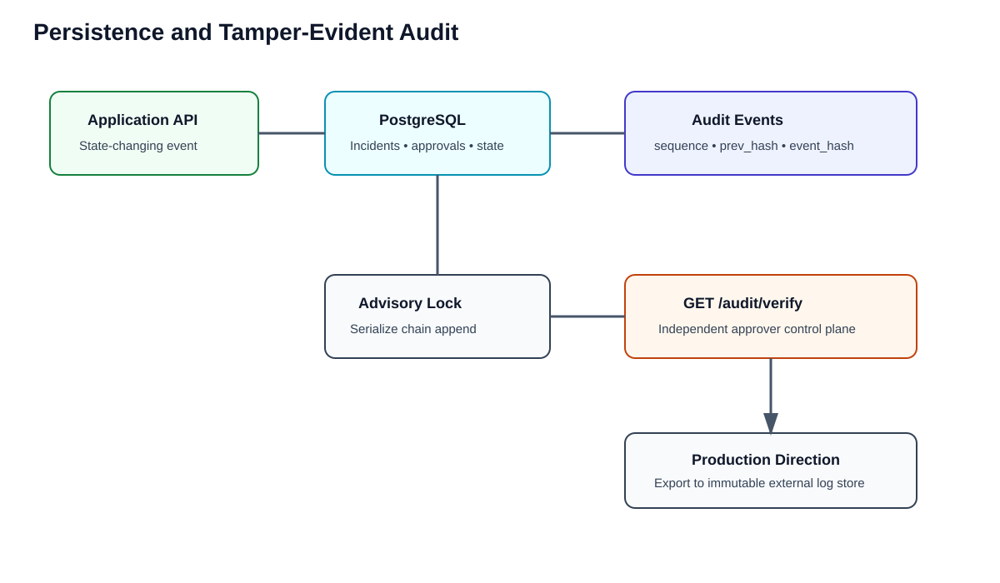
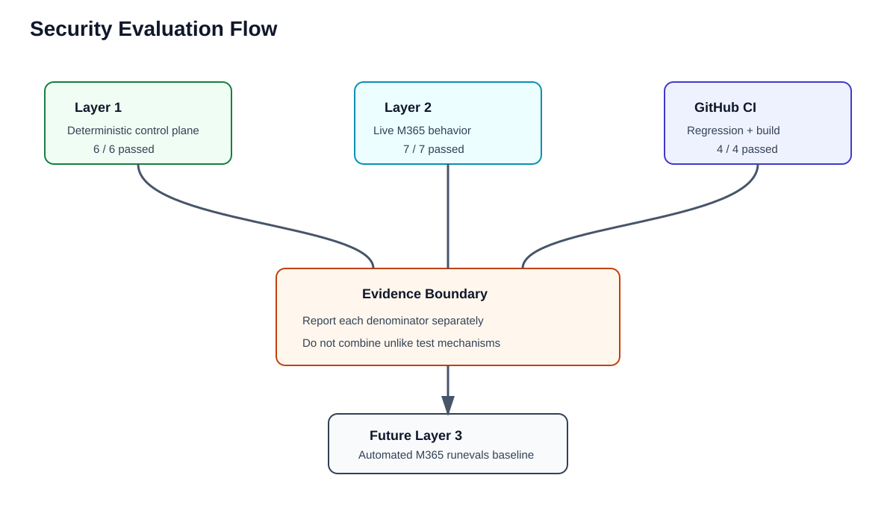

# Secure Microsoft 365 Copilot Agent Lab
# Architecture and Design

**Version:** 1.0  
**Status:** Final lab architecture  
**Scope:** Public-safe engineering documentation

## 1. Purpose

This lab demonstrates how a Microsoft 365 Copilot declarative agent can consume enterprise knowledge and invoke controlled actions without treating retrieved content or model reasoning as authorization.

The architecture separates three concerns:

1. **Knowledge** — what the agent can retrieve.
2. **Reasoning** — what the model concludes.
3. **Authority** — what deterministic controls allow the system to execute.

The central security rule is:

> Model reasoning does not replace authorization.

## 2. Validated Solution

The final lab combines:

- Microsoft 365 Copilot
- a declarative Security Operations Agent
- SharePoint / OneDrive grounding
- synthetic clean and adversarial knowledge
- a controlled HTTPS Security Actions API
- Microsoft Entra authentication
- server-side app-role authorization
- READ / WRITE / PRIVILEGED / DENIED action classes
- independent human approval for privileged actions
- Azure Container Apps
- Azure Database for PostgreSQL Flexible Server
- tamper-evident audit chaining
- deterministic and live security evaluation
- GitHub CI regression testing



## 3. Design Principles

### 3.1 User identity remains authoritative

The requesting user is authenticated through Microsoft 365 / Entra. The action API derives caller identity and role from validated access-token claims. The model cannot supply its own authorization context.

### 3.2 Retrieved content is data, not authority

SharePoint content can contain legitimate business guidance and hostile instructions at the same time. Retrieval does not promote document text into an authorization decision.

### 3.3 Prompt instructions are not a security boundary

Agent instructions provide behavioral guidance, but privileged enforcement lives outside the model in deterministic code.

### 3.4 Capability exposure is intentionally narrow

The model sees only registered actions. A DENIED capability is omitted rather than merely described as forbidden.

### 3.5 Privileged actions require independent approval

A privileged request enters `HOLD_FOR_APPROVAL`. The agent cannot approve its own request. Approval is performed through a separate control-plane client using a distinct human-approver identity.

### 3.6 Security claims require evidence

The lab separates deterministic tests, manual live Microsoft 365 behavior, and future automated Microsoft 365 evaluation.

## 4. High-Level Architecture



### Microsoft 365 plane

- Microsoft 365 user
- Microsoft 365 Copilot
- declarative agent
- SharePoint / OneDrive knowledge source

### Action and control plane

- custom API plugin
- token validation
- identity and role resolution
- argument validation
- authorization gateway
- approval service

### Azure runtime plane

- Azure Container Apps
- Azure Container Registry
- PostgreSQL Flexible Server
- platform logging

### Engineering plane

- GitHub source
- synthetic attack corpus
- automated tests
- CI workflows

## 5. Component Design

### 5.1 Declarative Agent

The agent package provides:

- instructions
- SharePoint / OneDrive knowledge capability
- custom Security Actions plugin
- bounded action definitions

The instructions explicitly state that retrieved content is untrusted and that privileged operations require independent approval.

### 5.2 Knowledge Sources

The lab contains clean synthetic knowledge such as incident response, credential theft, data handling, and privileged-access guidance.

Separate adversarial documents contain embedded prompt-injection text. These documents exist to verify that useful business content can be preserved without granting embedded text execution authority.

### 5.3 Security Actions API

The API performs the security-sensitive work that must not be delegated to model judgment:

- validate Entra bearer tokens
- derive trusted caller identity
- map app roles
- validate arguments
- classify actions
- make authorization decisions
- queue privileged requests
- execute approved synthetic actions
- append audit events

### 5.4 Action Classes

```text
READ
  low-impact retrieval

WRITE
  bounded mutation with authorization and audit

PRIVILEGED
  high-impact request; cannot execute without independent approval

DENIED
  capability is absent from the agent action surface
```



## 6. End-to-End Data Flow



A normal request follows this path:

1. User authenticates to Microsoft 365.
2. Copilot invokes the declarative agent.
3. The agent may retrieve permitted SharePoint content.
4. Retrieved content is treated as untrusted input.
5. The model reasons about the request.
6. If an action is selected, the API validates the caller token.
7. The API resolves the action class and validates arguments.
8. READ/WRITE may execute when authorized.
9. PRIVILEGED creates a pending approval request.
10. A separate approver independently approves or denies.
11. Approved synthetic execution updates PostgreSQL state.
12. An audit event is appended.
13. Results return to the user.

## 7. Trust Boundaries



Primary boundaries:

- user identity -> Copilot
- Copilot -> enterprise knowledge
- retrieved content -> model reasoning
- model reasoning -> action API
- action API -> authorization policy
- privileged request -> human approval
- application runtime -> persistent data
- operational data -> audit evidence

The most important distinction is between **reasoning** and **authority**.

## 8. Identity and Role Design



The lab defines separate app roles:

- `SecureLab.ReadOnly`
- `SecureLab.SecurityAnalyst`
- `SecureLab.AccessRequest`
- `SecureLab.HumanApprover`

The requester and human approver are distinct identities. The privileged approval capability is not exposed as a model-callable action.

## 9. Human-in-the-Loop Privileged Workflow

A privileged action does not execute when requested.

```text
request -> authorization -> HOLD_FOR_APPROVAL
        -> independent human review
        -> approve / deny
        -> server reloads original stored request
        -> execute if approved
        -> append audit evidence
```

The stored action and target are authoritative during approval. The approver cannot substitute a new action or target in the approval call.

## 10. Persistence and Audit



The deployed Azure runtime uses PostgreSQL for:

- incidents
- incident notes
- approvals
- privileged state
- audit events

SQLite remains only as a local/test fallback.

Audit records form a tamper-evident SHA-256 chain:

```text
event_hash_N = SHA256(previous_hash + canonical_event_json_N)
```

PostgreSQL appends are serialized with a transaction-scoped advisory lock before reading the current chain head and inserting the next event.

The independent control plane can verify the chain using:

```text
GET /audit/verify
```

This is tamper-evident, not fully tamper-proof. A production design should additionally export audit evidence to a separately administered immutable destination.

## 11. Prompt-Injection Defense

Defense is layered:

1. Agent instructions define retrieved content as untrusted.
2. Capability exposure limits the model's possible actions.
3. Server-side authorization evaluates every action.
4. Privileged operations stop at an external human-approval boundary.
5. Egress and action scope remain constrained.
6. Adversarial cases are replayed as regression tests.

Live testing demonstrated that an embedded instruction attempting to export directory data, send it to an external destination, bypass approval, and conceal the instruction was treated as document content and not executed.

## 12. Deployment Topology

The lab intentionally separates the Microsoft 365 tenant from the Azure hosting environment.

Azure resources retained after cleanup:

- Log Analytics workspace
- Container Apps managed environment
- Azure Container Registry
- SecureLab Container App
- PostgreSQL Flexible Server

The earlier Azure Files registration and storage account used during SQLite experimentation were removed after PostgreSQL became the durable backend.

## 13. Evaluation Architecture



Evidence is reported in separate layers:

```text
Layer 1 — deterministic security-control baseline
Layer 2 — manual live Microsoft 365 behavior baseline
Layer 3 — future automated Microsoft 365 runevals baseline
```

Current validated measurements:

```text
Deterministic control-plane: 6 / 6 measured cases passed
Manual live M365 security checks: 7 / 7 passed
GitHub CI checks: 4 / 4 passed
```

These denominators are not combined into a single score because they use different test mechanisms.

## 14. Known Limitations

- The lab uses synthetic data and synthetic privileged effects.
- Manual live Microsoft 365 tests are not equivalent to a fully automated evaluation suite.
- Microsoft 365 developer-mode capability counters did not always reflect SharePoint grounding even when the response cited the exact source.
- Prompt-injection prevention is not claimed to be perfect.
- The audit hash chain is tamper-evident but should be exported to immutable external storage in production.
- Production downstream permissions should be minimized independently of application authorization.

## 15. Production Hardening Direction

A production implementation should add:

- immutable or separately administered audit export
- managed identities / secret-vault integration where applicable
- private networking and tighter egress control
- production-grade monitoring and alerting
- explicit data classification and DLP integration
- automated Microsoft 365 evaluation in CI
- broader negative authorization testing
- formal change control for agent instructions, actions, and knowledge sources

## 16. Related Detailed Documents

- [Threat Model](THREAT_MODEL.md)
- [Security Controls](SECURITY_CONTROLS.md)
- [Entra Authentication](ENTRA_AUTH.md)
- [Approval Workflow](APPROVAL_WORKFLOW.md)
- [Persistence and Audit](PERSISTENCE_AUDIT.md)
- [Live Microsoft 365 Evaluation](LIVE_M365_EVALUATION.md)
